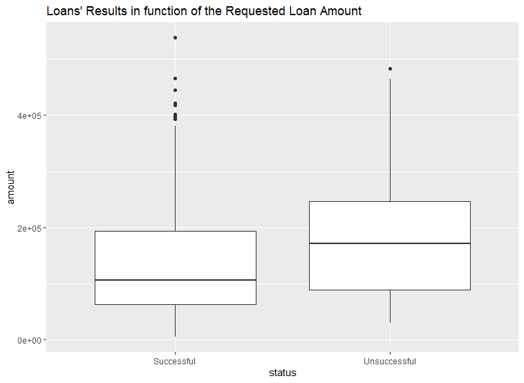

# Data Understanding
## Data Summarization

## Data Visualization

### Correlation Matrixs
#### **Comparison between all variables**

#### **Comparison between districs variables**

#### **Comparison between Loan variables**

### Boxplots 
#### **Loan's results in function of the client's age**

#### **Loan's results in function of the requested loan amount**

#### **Loan's results in function of the requested loan duration**

#### **Loan's results in function of the client's districts number of entrepreneurs per 100 inhabitants**

#### **Loan's results in function of the client's dictrict's average salary**

#### **Loan's results in function of the monthly loan payments**

### BarPlot
#### **Region's impact on loan's success**

#### **Month's impact on loans**

#### **Year's impact on loans**

### Statistics
#### **Number of different card owners**
+ classic: 127
+ gold: 9
+ junior: 41

#### **Number of users with disponents**
+ disponent: 869
+ owner: 4500

#### **Number of transactions and users**
fazer grafico  com os valores agrupados: 369/9=41
ntrans/nusers
+ 1/74
+ 2/22
+ 3/53
+ 4/69
+ etc ao id 369

## Conclusion

<!-- Pontos a ter em conta
- Diversity of statistical methods
- complexity of statistical methods
- interpretation of results of statistical methods 
- knowledge extraction from results of statistical methods 
-  diversity of plots 
- complexity of plots
- presentation
- interpretation of plots
- visual knowledge extraction 

Info sobre o que é suposto ser data understanding: https://moodle.up.pt/pluginfile.php/131724/mod_resource/content/1/T04-data-understanding-preparation.pdf
-->
